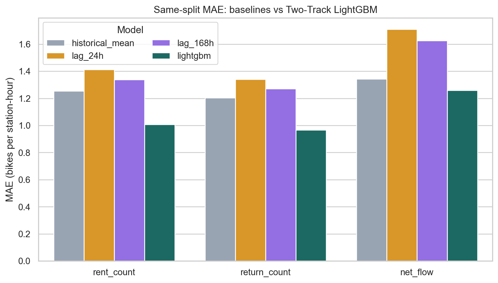
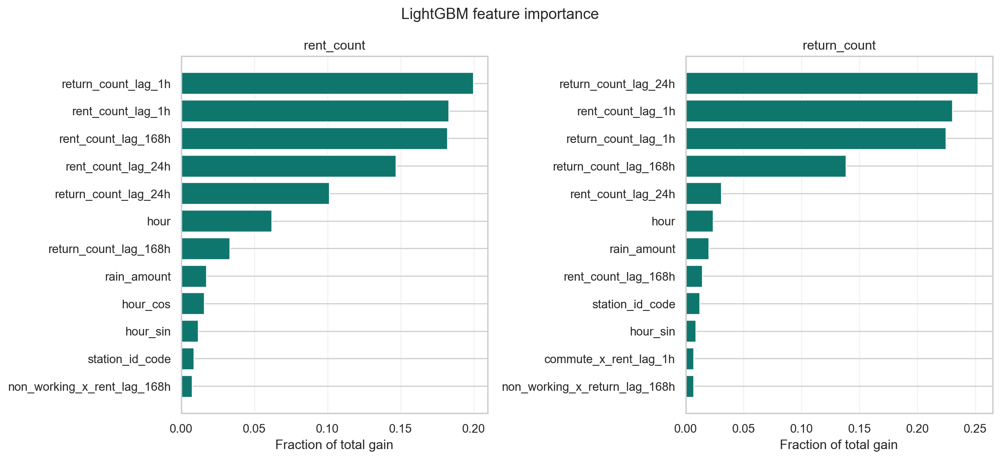

# Seoul Bike Demand Forecasting

[](https://github.com/michael1119676/Seoul-Bike-Demand-Forecasting-Using-Two-Track-LightGBM/actions/workflows/ci.yml)

Reproducible station-hour demand forecasting with separate LightGBM models for
bike rentals and returns. Net flow is derived as `predicted returns - predicted
rentals` for rebalancing analysis.

## Verified result: April 2026

These are newly executed results on **2,001,000 real station-hour test rows**,
not copied from the report and not produced from synthetic data. Every model
uses the same chronological split and test rows.

| Target | LightGBM MAE | RMSE | R² | Best baseline MAE | MAE improvement |
|---|---:|---:|---:|---:|---:|
| Rent count | **1.0074** | 1.8225 | 0.7130 | 1.2539 (historical mean) | **19.66%** |
| Return count | **0.9660** | 1.7281 | 0.7520 | 1.2038 (historical mean) | **19.75%** |
| Net flow | **1.2589** | 2.1365 | 0.4139 | 1.3424 (historical mean) | **6.22%** |



The feature-group ablation supports the time-series design: removing all lag
features increased MAE by 0.1541 for rent, 0.1557 for return, and 0.1094 for net
flow on the fixed ablation subset.

### Limits to read before using the numbers

- This is **rolling one-hour-ahead** forecasting: observations through `t-1` are
  available when predicting hour `t`. It is not a multi-hour frozen forecast.
- Training uses the report's reproducible 30% monthly sample: 21,946,693 rows.
  Validation is March 2026; test is April 2026.
- Raw and processed data are not committed. Input fingerprints and row counts are
  in [`data_audit.json`](results/actual_202604/data_audit.json).
- The exact processed snapshot used by the attached final report was not
  available. Differences from its quoted metrics are documented in
  [`reproducibility_notes.md`](docs/reproducibility_notes.md).
- A non-physical `station_id="X"` placeholder is excluded by an explicit,
  audited `^ST-\d+$` rule. April's remaining unknown-district rate is 0.40%.

## What is now reproducible

- config/CLI paths instead of private Google Drive constants;
- fixed Python dependencies, random seeds, LightGBM seeds, and run manifest;
- strict station-sorted lag-1/24/168 generation with exact timestamp checks;
- historical mean, lag-24, and lag-168 baselines;
- MAE, RMSE, and R² for rent, return, and direct net flow;
- station/hour/district error analysis;
- LightGBM gain importance and feature-group ablation;
- compact committed CSV/JSON/PNG results;
- synthetic fixture unit tests and GitHub Actions.

## Split and evaluation protocol

| Split | Period | Rows used | Purpose |
|---|---:|---:|---|
| Train | 2022-12 to 2025-12 | 21,946,693 (30% sample) | Model fitting |
| Validation | 2026-03 | 2,066,880 | Early stopping |
| Test | 2026-04 | 2,001,000 | Final comparison |

`historical_mean` is a station-hour mean fit on the sampled training split with
hour/global fallbacks. `lag_24h` and `lag_168h` use the matching target's strict
lag. All baselines predict rent and return separately; net-flow metrics are
computed from the difference of those predictions.

## Installation

Python 3.11-3.13 is supported. For the exact environment used by the committed
run:

```bash
python3 -m venv .venv
.venv/bin/python -m pip install -r requirements-lock.txt
```

On macOS, the LightGBM wheel also needs OpenMP:

```bash
brew install libomp
```

## Input contract and feature preparation

The preparation command accepts monthly `unscaled_YYYYMM.csv.gz` files with
station/time keys, separate targets, station coordinates, time/calendar fields,
and weather fields. `--station-metadata` may point to either:

- a UTF-8 file with `station_id,district`, or
- the CP949 Seoul station master format with `대여소_ID,주소1`.

No input path is hard-coded:

```bash
PYTHONPATH=src .venv/bin/python -m seoul_bike_forecasting.cli prepare \
  --input-dir "/absolute/path/to/monthly_sources" \
  --output-dir "data/processed/two_track" \
  --station-metadata "/absolute/path/to/station_master.csv"
```

The command emits monthly `model_features_YYYYMM.parquet` files and a
`preparation_manifest.json`. Data artifacts remain ignored by Git.

## Run the experiment

Edit [`configs/default.yaml`](configs/default.yaml), or override paths from the
CLI:

```bash
PYTHONPATH=src .venv/bin/python -m seoul_bike_forecasting.cli run \
  --config configs/default.yaml \
  --feature-dir "data/processed/two_track"
```

The legacy-compatible entry point also works:

```bash
PYTHONPATH=src .venv/bin/python src/train_evaluate.py \
  --config configs/default.yaml \
  --feature-dir "data/processed/two_track"
```

## Results and diagnostics

Committed outputs are in [`results/actual_202604/`](results/actual_202604/):

- `metrics.csv` and `baseline_improvement.csv`;
- `error_by_station.csv`, `error_by_hour.csv`, `error_by_district.csv`;
- `feature_importance.csv` and `ablation.csv`;
- `data_audit.json` and `run_manifest.json`;
- four inspected figures and a generated `summary.md`.



The worst error period is the evening commute: net-flow MAE peaks at 18:00.
Among districts, Gwangjin-gu has the highest April net-flow MAE. These grouped
metrics should be used alongside row counts; they do not by themselves establish
causality.

## Tests

```bash
MPLCONFIGDIR=/tmp/seoul-bike-mpl .venv/bin/python -m pytest
```

The tests generate a small synthetic multi-station fixture, verify exact lag
timing and gap rejection, check chronological split isolation, and run the
complete training/reporting pipeline. Synthetic data are used only for tests.

## Repository structure

```text
configs/default.yaml
src/seoul_bike_forecasting/
  prepare.py       # source -> strict Two-Track parquet
  data.py          # schema, split, loading, data quality
  features.py      # feature groups, lag/leakage controls
  baselines.py     # historical mean, lag-24, lag-168
  models.py        # deterministic Two-Track LightGBM
  evaluation.py    # metrics, errors, importance
  reporting.py     # compact tables and figures
  pipeline.py      # experiment orchestration and manifest
tests/
results/actual_202604/
docs/reproducibility_notes.md
```

## Data policy

Do not commit raw trip records, monthly source files, prepared parquet, model
binaries, or predictions. Before redistributing source data, document the Seoul
open-data license and provenance for the exact snapshot.
